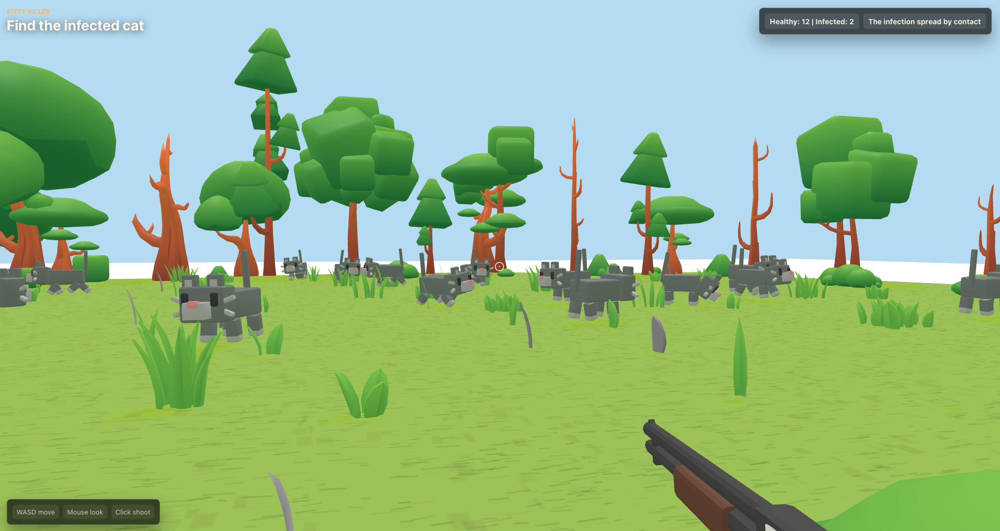

# Kitty Killer

A small browser game built with Babylon.js. Walk around a low-poly forest, find the infected cat, and stop the infection before it spreads.



## Controls

- `WASD` to move
- Mouse to look
- Click to shoot

## Run Locally

```sh
npm install
npm run dev
```

Open the local URL printed by Vite.

## Credits

Made because Parth, my 12-year-old cousin, forced me to make this game.
